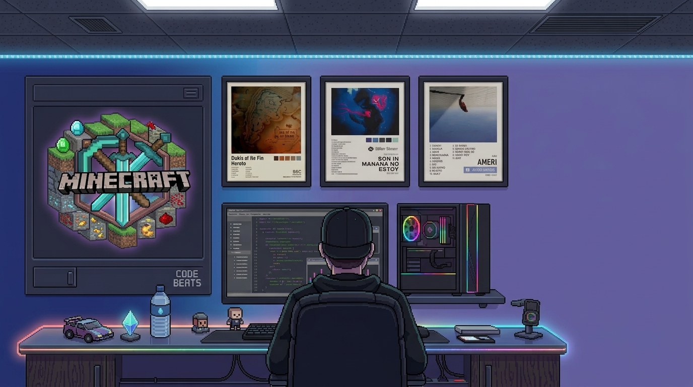

# ¡Hola 👋, soy Leonardo!

Soy estudiante de Ingeniería de Sistemas y desarrollador apasionado por la tecnología, el desarrollo de software y la creación de soluciones innovadoras.

Me interesa especialmente el desarrollo **Full Stack**, la arquitectura de software, el desarrollo de aplicaciones web y móviles, y el aprendizaje constante de nuevas tecnologías.

Mi objetivo es seguir creciendo como desarrollador, construyendo proyectos escalables, eficientes y con una excelente experiencia para los usuarios.

También disfruto explorando herramientas de **Inteligencia Artificial** para mejorar mi productividad, optimizar mi código y encontrar nuevas formas de resolver problemas.

---

### 🛠️ Tecnologías y herramientas

<table>
<tr>
<td><b>Lenguajes</b></td>
<td>

</td>
</tr>
<tr>
<td><b>Frontend</b></td>
<td>

</td>
</tr>
<tr>
<td><b>Backend</b></td>
<td>

</td>
</tr>
<tr>
<td><b>Bases de datos</b></td>
<td>

</td>
</tr>
<tr>
<td><b>DevOps &amp; Herramientas</b></td>
<td>

</td>
</tr>
<tr>
<td><b>Diseño</b></td>
<td>

</td>
</tr>
</table>

---

### 📌 Proyectos destacados

- **[Nombre del Proyecto 1](https://github.com/TU_USUARIO/proyecto1)** — breve descripción de qué hace, qué tecnologías usaste y qué problema resuelve.
- **[Nombre del Proyecto 2](https://github.com/TU_USUARIO/proyecto2)** — breve descripción de qué hace, qué tecnologías usaste y qué problema resuelve.
- **[Nombre del Proyecto 3](https://github.com/TU_USUARIO/proyecto3)** — breve descripción de qué hace, qué tecnologías usaste y qué problema resuelve.

---
